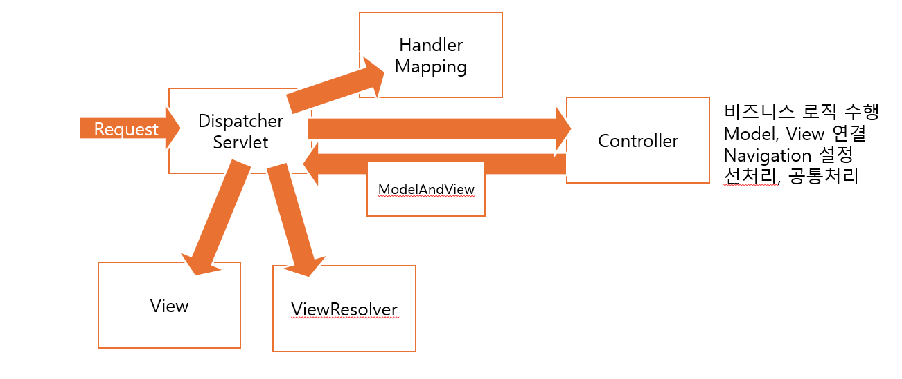
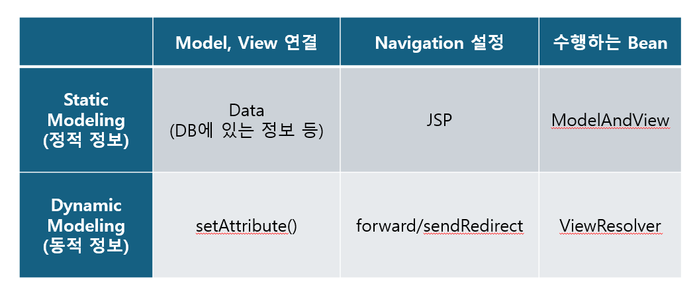

# 1. Controller의 구조

현재 Controller의 구조는 너무 많은 역할을 맡고 있다. 따라서 우리는 역할별로 모듈화를 할 필요가 있다. 

Model. View를 연결하는 역할은 `ModelAndView`,

Navigation을 설정하는 역할은 `ViewResolver`가 맡는다.




# 2. ModelAndView, ViewResolver의 기본 구조
### 1. ModelAndView
```
public class ModelAndView {
    String viewName
    String ObjectName
    Object Object
}
```

마치 `Map`처럼 jsp의 위치와 Object의 이름, Object의 레퍼런스를 한 번에 받을 수 있도록 되어있다.

### 2. ViewResolver
```
public class ViewResolver {
    // forward 방식으로 보내는 메서드
    // redirect로 보내는 방식도 따로 만들 수 있다.
    public void forward(HttpServletRequest request,
                        HttpServletResponse response,
                        ModelAndView modelAndView) {
        // 필요한 기능 구현
    }
}
```
`ModelAndView`의 데이터를 알맞는 jsp로 보내는 역할을 수행한다.


# 3. Spring Framework
이러한 기능을 Spring Framework에서 직접 지원해준다.

`org.springframework.web.servlet`의 API를 확인하면 다음과 같다.

[Spring Framework 5.3.32 API](https://docs.spring.io/spring-framework/docs/5.3.32/javadoc-api/)

1. ModelAndView
2. ViewResolver
3. HandlerMapping
4. DispatchServlet
5. mvc.Controller

이처럼 우리에게 필요한 Interface 및 Class를 Spring에서 제공해준다. 우리는 이를 잘 사용하면 될 것이다.

# 4. xml에서의 표현
### 1. web.xml
1. DispatcherServlet : Spring MVC에서 단일인입점 선언, meta-data의 기본은 action-servlet.xml이 된다.
```
<servlet>
    <servlet-name>action</servlet-name>
    <servlet-class>
    org.springframework.web.servlet.DispatcherServlet
    </servlet-class>
    <init-param>
        <param-name>contextConfigLocation</param-name>
        <param-value> 
        /WEB-INF/module01-servlet.xml, 
        /WEB-INF/module02-servlet.xml 
        </param-value>
    </init-param>
<load-on-startup>1</load-on-startup>
```

2. Servlet 처리 : 확장자가 .do일 경우 action servlet-name으로 선언적 이름을 갖는 Servlet을 처리한다.
```
<servlet-mapping>
    <servlet-name>action</servlet-name>
    <url-pattern>*.do</url-pattern>
</servlet-mapping>
```

3. ViewResolver : View 화면을 Navigation 한다.
```
<bean id="viewResolver" class="org.springframework.web.servlet.view.InternalResourceViewResolver"/>
```

4. HandlerMapping : Client의 Request URI와 Controler를 연결한다.
```
<bean id="simpleUrlMapping" class="org.springframework.web.servlet.handler.SimpleUrlHandlerMapping">
    <property name="order" value="1"/>
    <property name="mappings">
        <props>
            prop key="module02.do">helloSpringController</prop>
        </props>
    </property>
</bean>
```

5. Controller의 요구사항을 처리할 Controller를 선언한다. 이때 Controller는 `mvc.controller`를 구현해야 한다.
```
<bean id="helloSpringController" class="test.HelloSpringController"/>
```

```
public class HelloSpringController implements Controller {

	public ModelAndView handleRequest(HttpServletRequest request,
    							      HttpServletResponse response) 
                                      throws Exception {
        // 필요한 기능 구현
	}
}
```

# 5. Annotaion을 사용한 방법
1. web.xml
```
<?xml version="1.0" encoding="UTF-8"?>

<web-app xmlns="http://xmlns.jcp.org/xml/ns/javaee"
				 xmlns:xsi="http://www.w3.org/2001/XMLSchema-instance"
  				 xsi:schemaLocation="http://xmlns.jcp.org/xml/ns/javaee;
                      http://xmlns.jcp.org/xml/ns/javaee/web-app_4_0.xsd"
              	 version="4.0"
 				 metadata-complete="true">
 				 
	<!-- Spring API에서 제공하는 CharacterEncodingFilter로 한글 인코딩을 처리한다. -->
	<filter>
		<filter-name>encodingFilter</filter-name>
		<filter-class>org.springframework.web.filter.CharacterEncodingFilter</filter-class>
		<init-param>
			<param-name>encoding</param-name>
			<param-name>EUC_KR</param-name>
		</init-param>
	</filter>
	
	<filter-mapping>
		<filter-name>encodingFilter</filter-name>
		<url-pattern>/*</url-pattern>
	</filter-mapping>
	
	<!-- SpringMVC에서의 Front Controller(단일인입점) DispatcherServlet 선언 -->
    <servlet>
        <servlet-name>action</servlet-name>
        <servlet-class>org.springframework.web.servlet.DispatcherServlet</servlet-class>
        <init-param>
        	<param-name>contextConfigLocation</param-name>
        	<param-value>/config/springMVC/common-servlet.xml</param-value>
        </init-param>
        <load-on-startup>1</load-on-startup>
    </servlet>

    <servlet-mapping>
        <servlet-name>action</servlet-name>
        <url-pattern>*.do</url-pattern>
    </servlet-mapping>
</web-app>
```

2. common-servlet.xml
```
<?xml version="1.0" encoding="UTF-8"?>

<beans xmlns="http://www.springframework.org/schema/beans"
		xmlns:context="http://www.springframework.org/schema/context"
		xmlns:xsi="http://www.w3.org/2001/XMLSchema-instance"
		xsi:schemaLocation=
				"http://www.springframework.org/schema/beans 
				http://www.springframework.org/schema/beans/spring-beans.xsd
				http://www.springframework.org/schema/context 
				http://www.springframework.org/schema/context/spring-context.xsd">
    
    <!-- 공통적인 사항을 설정한 common-servlet.xml 사용 -->
    
    <!--어노테이션 기반 :: Spring Framework 사용.
    	@Controller annotation 선언된 Bean 만 Wiring
		@Service / @Repository  annotation 선언된 Bean 은 Scan 제외-->

	<context:component-scan base-package="spring.web">
		<context:include-filter type="annotation"
								expression="org.springframework.stereotype.Controller" />
		<context:exclude-filter type="annotation" 
								expression="org.springframework.stereotype.Service"/>
		<context:exclude-filter type="annotation" 
								expression="org.springframework.stereotype.Repository"/>
	</context:component-scan>            

                
	 <!-- Annotation 지원 HandlerMapping 선언 :  Spring 4.X -->
	 <!-- <bean class="org.springframework.web.servlet.mvc.annotation.DefaultAnnotationHandlerMapping"/> -->
	 
	<!-- Annotation 지원 HandlerMapping 선언 :  Spring 5.X -->
	<bean class="org.springframework.web.servlet.mvc.method.annotation.RequestMappingHandlerMapping"/>
	
	<!-- ViewResolver 선언 -->	
    <bean id="viewResolver"
				class="org.springframework.web.servlet.view.InternalResourceViewResolver" />
	

	<!-- exception resolver  선언 :: 서술적 / 선언젝 예외처리 -->
	<bean id="exceptionResolver"
				class="org.springframework.web.servlet.handler.SimpleMappingExceptionResolver">
		<property name="exceptionMappings">
			<props>
				<prop key="java.lang.NullPointerException">/common/nullError.jsp</prop>
				<prop key="java.lang.NumberFormatException">/common/numberFormatError.jsp</prop>
			</props>
		</property>
		
		<!-- 공통 Error page -->
		<property name="defaultErrorView"	value="/common/error.jsp" />
	</bean>

</beans>
```

3. Controller : UserController로 실습하였다.
```
package spring.web.user;

import java.util.Map;

import javax.servlet.http.HttpServletRequest;
import javax.servlet.http.HttpSession;

import org.springframework.stereotype.Controller;
import org.springframework.ui.Model;
import org.springframework.web.bind.annotation.ModelAttribute;
import org.springframework.web.bind.annotation.RequestMapping;
import org.springframework.web.bind.annotation.RequestParam;
import org.springframework.web.servlet.ModelAndView;

import spring.domain.User;

@Controller
public class UserController {

	public UserController() {
		System.out.println("[UserController] Default constructor call");
	}
	
	/*
	 * return : ModelAndView
	 */
	
	// 0. 단순 Navigation, Business Login 수행 없음
	@RequestMapping("/logonViewModelAndView.do")
	public ModelAndView logonViewModelAndView() {
		System.out.println("[UserController.logonViewModelAndView()] start");
		
		ModelAndView modelAndView = new ModelAndView();
		modelAndView.setViewName("/user/logonView.jsp");
		
		return modelAndView;
	}
	
	// 1.  HttpServletRequest를 이용한 Client Data, HttpSession 처리
	@RequestMapping("/logon01.do")
	public ModelAndView logon01(HttpServletRequest request) {
		System.out.println("[UserController.logon01()] start");
		
		String userId = request.getParameter("userId");
		String password = request.getParameter("password");
		
		// Request
		request.setAttribute("userId", userId);
		
		// Session
		HttpSession session = request.getSession(true);
		session.setAttribute("password", password);
		
		// ModelAndView -> request
		ModelAndView modelAndView = new ModelAndView();
		modelAndView.addObject("message", "Controller 구현 연습");
		
		// 1) Forward로 진행할 경우
		modelAndView.setViewName("/user/logonResult.jsp");
		
		// 2) SendRedirect로 진행할 경우
		// modelAndView.setViewName("redirect:/user/logonResult.jsp");
		
		return modelAndView;
	}
	
	// 2.  HttpServletRequest, HttpSession 이용 처리
	@RequestMapping("/logon02.do")
	public ModelAndView logon02(HttpServletRequest request, 
								HttpSession session) {
		System.out.println("[UserController.logon02()] start");
		
		String userId = request.getParameter("userId");
		String password = request.getParameter("password");
		
		// Request
		request.setAttribute("userId", userId);
		
		// Session
		// HttpSession session = request.getSession(true);
		session.setAttribute("password", password);
		
		// ModelAndView -> request
		ModelAndView modelAndView = new ModelAndView();
		modelAndView.addObject("message", "Controller 구현 연습");
		
		// 1) Forward로 진행할 경우
		modelAndView.setViewName("/user/logonResult.jsp");
		
		// 2) SendRedirect로 진행할 경우
		// modelAndView.setViewName("redirect:/user/logonResult.jsp");
		
		return modelAndView;
	}
	// 3.  HttpServletRequest, HttpSession, @RequestParam 이용 처리
	@RequestMapping("/logon03.do")
	public ModelAndView logon03(@RequestParam("userId") String userId,
								@RequestParam("password") String password,
								HttpServletRequest request, 
								HttpSession session) {
		System.out.println("[UserController.logon03()] start");
		
		// String userId = request.getParameter("userId");
		// String password = request.getParameter("password");
		
		// Request
		request.setAttribute("userId", userId);
		
		// Session
		session.setAttribute("password", password);
		
		// ModelAndView -> request
		ModelAndView modelAndView = new ModelAndView();
		modelAndView.addObject("message", "Controller 구현 연습");
		
		modelAndView.setViewName("/user/logonResult.jsp");
		
		return modelAndView;
	}
	
	// 4.  @ModelAttribute 이용 처리
	@RequestMapping("/logon04.do")
	public ModelAndView logon04(@ModelAttribute("user") User user,
								HttpServletRequest request, 
								HttpSession session) {
		System.out.println("[UserController.logon04()] start");
		
		// 필요한 Object Scope에 저장한다.
		// Request
		request.setAttribute("userId", user.getUserId());
		// Session
		session.setAttribute("password", user.getPassword());
		
		// ModelAndView -> request
		ModelAndView modelAndView = new ModelAndView();
		modelAndView.addObject("message", "Controller 구현 연습");
		
		modelAndView.setViewName("/user/logonResult.jsp");
		
		return modelAndView;
	}
	
	// 5.  @ModelAttribute 이용 처리 (2)
	@RequestMapping("/logon05.do")
	public ModelAndView logon05(@ModelAttribute() User user) {
		System.out.println("[UserController.logon05()] start");
		
		ModelAndView modelAndView = new ModelAndView();
		modelAndView.addObject("message", "Controller 구현 연습");
		
		modelAndView.setViewName("/user/logonResult.jsp");
		// modelAndView.setViewName("redirect:/user/logonResult.jsp");
		return modelAndView;
	}
	
	/*
	 * return : String
	 */
	
	// 0. 단순 Navigation, Business Login 수행 없음
	@RequestMapping("/logonViewString.do")
	public String logonViewString() {
		System.out.println("[UserController.logonViewString()] start");
		
		return "/user/logonView.jsp";
	}
	
	// 6. HttpServletRequest, HttpSession, @ModelAttribute
	@RequestMapping("/logon06.do")
	public String logon06(@ModelAttribute("user") User user,
						  HttpServletRequest request,
						  HttpSession session,
						  Map<String, String> map) {
		System.out.println("[UserController.logon06()] start");
		
		request.setAttribute("userId", user.getUserId());
		session.setAttribute("password", user.getPassword());
		
		// map을 사용해도 request에 자동으로 Binding한다.
		map.put("message", "Controller 구현 연습");
		
		// return "/user/logonResult.jsp";
		
		return "redirect:/user/logonResult.jsp";
	}
	
	// 7.@RequestParam, Model
	@RequestMapping("/logon07.do")
	public String logon07(@RequestParam("userId") String userId, 
						  @RequestParam("password") String password,
						  Model model) {
		System.out.println("[UserController.logon07()] start");
		
		User user = new User();
		user.setUserId(userId);
		user.setPassword(password);
		
		model.addAttribute("user", user);
		model.addAttribute("userId", userId);
		model.addAttribute("password", password);
		model.addAttribute("message", "Controller 구현 연습");
		
		return "/user/logonResult.jsp";
	}
}

```
사용법을 잘 확인하고 적용해보도록 하자.
### 주의할 점
- `@ModelAttribute()` 으로 설정된 instance는 자동으로 `Request Object Scope`로 설정되어 보내진다.
- 6번의 map도 받게 된다면 자동으로 `Request Object Scope`로 보내지게 된다. 