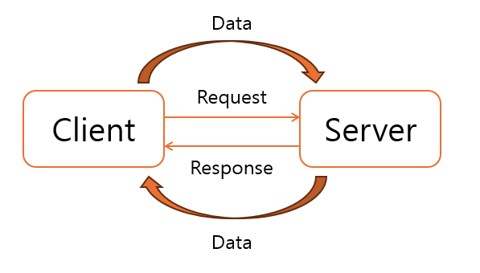
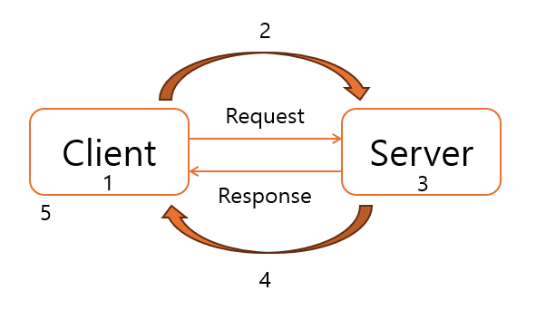
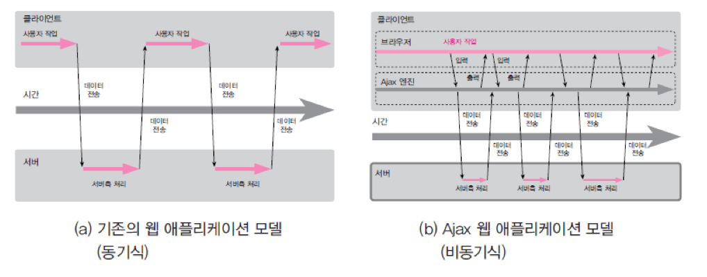
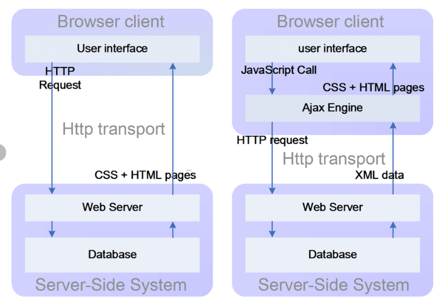

# 1. Ajax : Asynchronous javascript and xml
### 1. 개요

목적 : Client - Server 내에서의 UI 요청, 전달이 아닌, 따로 `Data`만을 받고 싶다!


> 1. Event 시작
> 2. `HTTP Protocol` 전달 (`Header`, `Body`)
> 3. Request 처리 (= Make data)
> 4. response 받기 (= Data 전송)
> 5. Display (= UI 적용)

결국, JS로  Request를 잘 해보는 것이 목표!

### 2. 동기와 비동기



[출처_1](https://scoring.tistory.com/entry/AJAX%EB%9E%80-JQuery%EB%A5%BC-%EC%9D%B4%EC%9A%A9%ED%95%9C-AJAX%EC%82%AC%EC%9A%A9%EB%B2%95)
[출처_2](https://www.researchgate.net/figure/The-comparison-between-a-classic-web-application-model-and-an-Ajax-web-application-model_fig3_241415122)

기본적으로 Ajax Engine을 통해서 비동기 요청을 구현한다.

### 3. Ajax Coding 절차
<Client>
1. XMLHTTPRequest 형성
2. open(method, url , true/false); // true : 비동기
3. callback Function 지정 (이벤트 실행 시 같이 실행되는 function)
4. send()로 request 전송

> **콜백 함수**
>
> 프로그래밍에서 콜백(callback) 또는 콜백 함수(callback function)는 다른 코드의 인수로서 넘겨주는 실행 가능한 코드를 말한다. 
>
> [출처 - 위키백과](https://ko.wikipedia.org/wiki/%EC%BD%9C%EB%B0%B1)

### 4. 코드 정리
```
<!DOCTYPE html>
<html lang="en">
<head>
    <meta charset="UTF-8">
    <meta name="viewport" content="width=device-width, initial-scale=1.0">
    <title>01</title>
    <script type = "text/javascript">
        var request = null;
        function createRequest() {
            try {
                request = new XMLHttpRequest();
                alert("XMLHttpRequest()로 request instance 생성 완료");
            } catch (trymicrosoft) {
                try {
                    request - new ActiveXObject("Msxml2.XMLHTTP");
                    alert("ActiveXObject(Msxml2.XMLHTTP)로 request instance 생성 완료");
                } catch (othermicrosoft) {
                    try {
                        request = new ActiveXObject("Microsoft.XMLHTTP");
                        alert("ActiveXObject(Microsoft.XMLHTTP)로 request instance 생성 완료");
                    } catch(failed) {
                        request = null;
                    }
                }
            }

            if(request == null) {
                alert("request 객체 생성 시 error 발생");
            }
        }

        function getSold() {
            createRequest();

            var url = "...";

            request.open("GET", url, true);     // 비동기

            request.open("GET", url, false);    // 동기

            request.onreadystatechange = updatePage;

            console.log("1. request.readyState : " + request.readyState);
            request.send();
            console.log("2. request.readyState : " + request.readyState);
            console.log("3. request.readyState : " + request.readyState);
            console.log("4. request.readyState : " + request.readyState);
        }

        function updatePage() {
            console.log("updatePage() : " + request.readyState);
        }
    </script>
</head>
<body>
...(생략)
</body>
</html>
```
위 예제를 동기 상태나 비동기 상태로 테스트를 한다면, 동기 상태일 때는 서버로 전송된 요청이 도착할 때까지 다음 코드로 넘어가지 않는 반면, 비동기 상태일 때는 서버로 요청을 전송한 뒤 바로 다음 코드로 넘어가는 차이점이 있다. 우리는 이를 통해서 동기와 비동기 상태의 차이점을 알 수 있다. 


### 5. request.readyState의 설명
- 1번 : 요청이 초기화된 상태 (open() 호출, send() 미호출)
- 2번 : server에 요청이 시작된 상태 (send() 호출, server에 미도착)
- 3번 : server에서 요청 처리가 종료된 상태 = client에 결과가 도착하는 시점 
- 4번 : server에서 요청 처리가 client로 완전히 온 상태 (server에서 전송된 data client에 도착) 