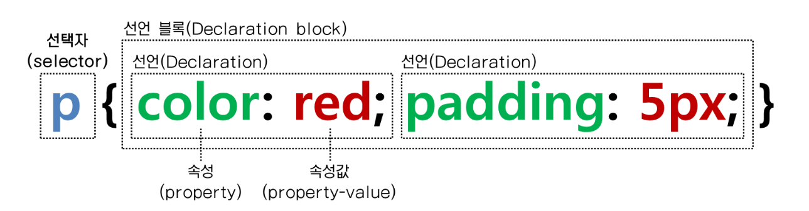

# Semantic Web : 시멘틱 웹
- '의미론적인 웹'
- 컴퓨터가 사람을 대신하여 정보를 읽고, 이해하고 가공하여 새로운 정보를 만들어 낼 수 있도록 만든 웹
- 특정 tag에 의미를 부여하여 화면 구성 시 의도를 기계적으로 전달할 수 있게 한다.
> 에시 : `<header>` `<section>` `<nav>` `<article>` `<aside>` `<footer>` 등
- 검색 엔진에서 더 많은 노출을 노릴 수 있다.

# 반응형 웹
디바이스의 디스플레이의 종류에 반응하여 그에 맞도록 적절하게 UI 요소들이 유기적으로 배치되도록 설계된 웹을 말한다.

> 앞으로 사용할 `BootStrap`에 이러한 반응형 웹 디자인이 적용되어 있다. 

# CSS
### 1) CSS Selector

1. 선택자의 종류
- `*` : 전부 다
- `tag` : 태그
- `.class` : 클래스
- `#id` : ID

위 선택자와 함께 적절한 사용법으로 CSS를 원하는 위치에 적용시킬 수 있다.

jQuery에서 이러한 Selector 기법을 가져와 사용하게 된다.

# BootStrap
- `오픈 소스 프론트엔드 프레임워크`

> https://getbootstrap.com/ 에 docs 등을 읽고 사용할 수 있도록 하자.